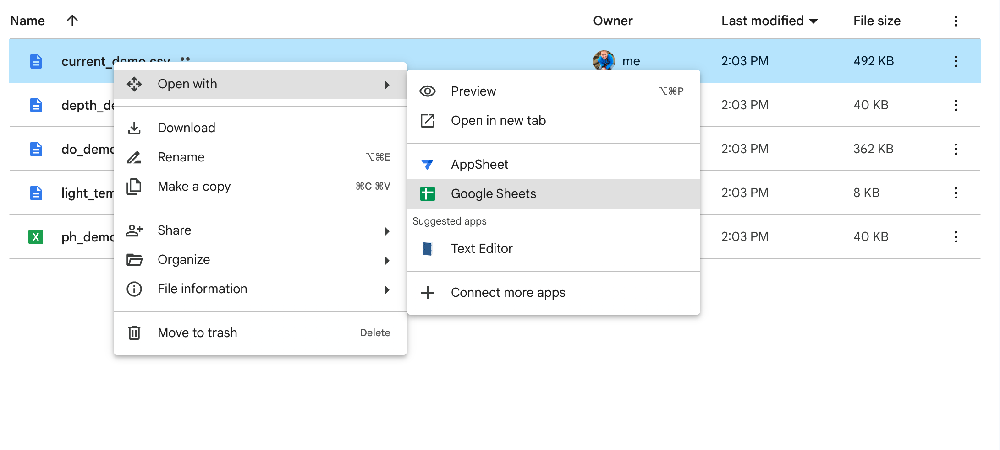
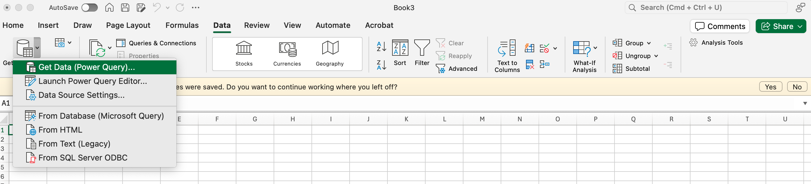
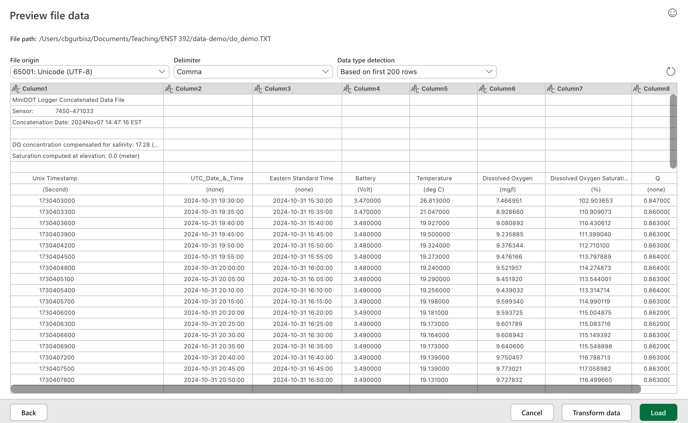
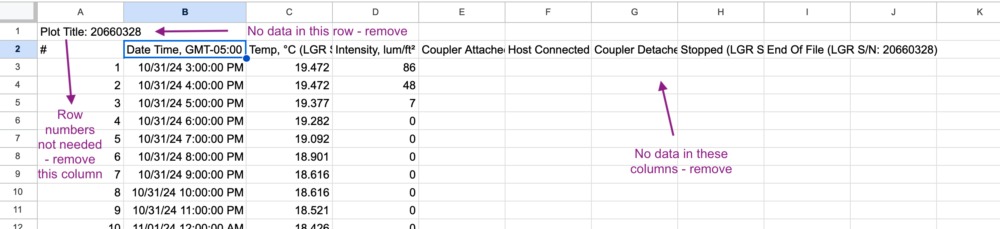
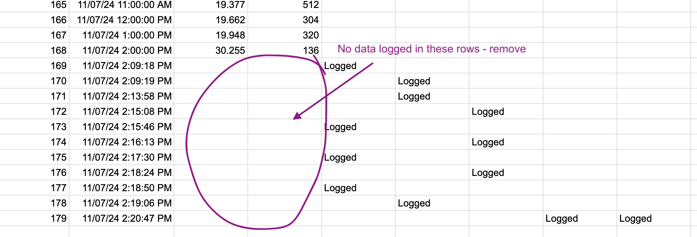
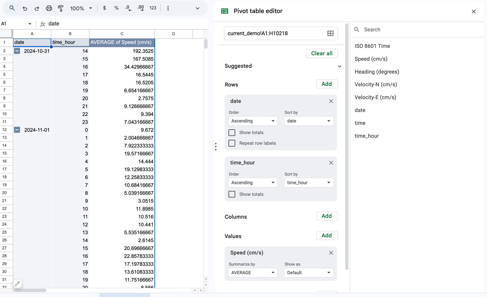

## Housekeeping

* Quiz Thursday: Be able to articulate your hydrologic field study data analysis methods and how they will enable you to test your hypotheses
* Lab Thursday is indoors: data analysis and poster workshop

## Learning objectives

* Tidy, wrangle, and analyze hydrologic data for hypothesis testing.
* Articulate how you will analyze your data to address your hypotheses.

## Resources
* [Data organization in spreadsheets slides](https://docs.google.com/presentation/d/1ZN_ijD-HA0sWme2a1BvdeH27_FyqzHToK-fItbCxli8/edit?usp=drive_link)
* [Poster groups spreadsheet](https://docs.google.com/spreadsheets/d/1BgDhoONcbGGGXkjJAlRhcocOCIhK9FUYvEODWMZDmXY/edit?usp=sharing)
* [Lab 3 group folders](https://drive.google.com/drive/u/0/folders/1wtrXccYT4a-26WlzA1wwQgkIST36K7t7)
* [Milroy Ch. 8: Introduction to univariate analysis](https://mrne392.github.io/lesson-plans/readings/Milroy_Ch8.pdf)
* [Milroy Ch. 9: Introduction to multivariate analysis](https://mrne392.github.io/lesson-plans/readings/Milroy_Ch9.pdf)
* [Data organization in spreadsheets paper](https://www.tandfonline.com/doi/full/10.1080/00031305.2017.1375989)

## Lesson plan

#### Poster titles

Enter your poster titles into the [Poster groups spreadsheet](https://docs.google.com/spreadsheets/d/1BgDhoONcbGGGXkjJAlRhcocOCIhK9FUYvEODWMZDmXY/edit?usp=sharing)

#### Review data organization in spreadsheets
In your groups please review the [Data organization in spreadsheets slides](https://docs.google.com/presentation/d/1ZN_ijD-HA0sWme2a1BvdeH27_FyqzHToK-fItbCxli8/edit?usp=drive_link) or [paper](https://www.tandfonline.com/doi/full/10.1080/00031305.2017.1375989). 

#### Data cleaning and wrangling

Next, we will work on organizing and cleaning our hydrologic field study lab. Our goal is to have our data in tidy format, which means all data sets will be rectangular, with consistent column names and date formats and no ancillary header or footer material. We also need to make sure all of the datasets that you plan on using to investigate comparisons/relationships have the same number of observations. If not, we need to do some data wrangling.  

I recommend that since this is a group project, you mostly analyze your data in the Google Sheets in your group's shared Drive folder. That way you can see each other's edits and you don't need to email a mess of multiple file versions to each other. Google Sheets doesn't have all of the functionalities that Excel has (e.g., it doesn't make box and whisker plots and it doesn't let you plot the standard deviation/error correctly), so if you need to use Excel, make sure you have a plan for how you will delegate tasks and share your work. 

**Get organized**

1. Make a folder in your group's lab folder named "your group raw data" (e.g., Group 1 raw data). Move all of your data files to the raw data folder. You will not modify any of these files. Their job is to live here and serve as backup in case you mess up the data at any point during the analysis phase.

2. Make another folder in your group's lab folder named "your group data analysis" (e.g., Group 1 data analysis). Make a copy of the files in your raw data folder and move them here. Don't just drag the raw files into this folder - make sure you make a copy first, otherwise you will just be moving your original raw files.

**Make consistent file formats**

3. First, let's get all of our files into the same format. 

    a. If you have any .csv or .xlsx or .xls files, right-click on the file, select open with, then select Google Sheets. There should now be a copy of the file in Google Sheets format. Delete the .csv file from your data analysis folder (NOT your raw data folder!).

    b. If you have any .txt files from the oxygen loggers, make a folder on your computer's desktop or in your computer's documents folder and name it so that you will know what's in it (e.g., MRNE392_hydro_data). Right-click on the .txt file, select Download, and direct your computer to save it in the folder you just made.

    c. Next open Excel. Select the Data tab. Select Get Data/Get Data (Power Query).
    
    
          **For Mac users**, select Text/CSV, use the Browse button to select the file you saved in step 3b, then select Get Data, then select Next. A preview file will appear. Select Load (located on the bottom right of the screen).
      
      
          **For Windows users**, Go to File > Open and browse to the location that contains the text file. Select Text Files in the file type dropdown list in the Open dialog box. Locate and double-click the text file that you want to open. If the file is a text file (.txt), Excel starts the Import Text Wizard. When you are done with the steps, click Finish to complete the import operation. See Text Import Wizard for more information about delimiters and advanced options.
          
      d. Go to File > Save and save this file in the folder you made on your computer. Save the file in .xlsx format. 
      
      e. Next, open Finder (Mac users) or Windows Explorer (Windows users) and drag this file into your Google Drive data analysis folder. Repeat step 3a for this file.  

**Data tidying and time formatting**

4. At this point, you should only have Google Sheets docs in your data analysis Google Drive folder. Now we need to tidy our data. 

    a. Remove all header rows at the top of the spreadsheet. 
    
    
        Remove any extra rows at the bottom and/or columns that don't contain data.
    
    
    b. Reformat your column names using snake case (all lower caps, underscore (_) instead of space (" "). Make sure the column names include measurement units (e.g., do_mg_l). Name all of your date/time columns datetime_est (or datetime_edt if the time zone is EDT).
    
    c. Check which time zone your data are reported in. Eastern Daylight Time (EDT) is 4 hours behind GMT/UTC (or GMT/UTC-4). Eastern Standard Time (EDT) is 5 hours behind GMT/UTC (or GMT/UTC-5). The oxygen files have an EST column. The current speed files are in EDT. The HOBO logger files seem to be a mix - you need to check these. If all of your datasets were collected in either EST or EDT, you don't have to do anything else (the date/time of each spreadsheet is in the same time zone). If one of your datasets was collected in EDT and another is in EST, you should convert both to EST. To convert time from EDT to EST: 
    
        * create a new colunn called datetime_est. 
        
        * In the first cell of this new column, enter the formula =B2-1/24, where B2 is the first cell of your **datetime_edt** column. This subtracts an hour from the time. Note that the cell numbers in your spreadsheet are likely different from the cell numbers provided in my formula (for example B2 in my spreadsheet my be, say, C2 in your spreadsheet). For this formula and others, make sure that you are selecting the cell that corresponds to the correct variable -- datetime_edt in this case.
        
        * Double click the bottom right corner of this cell to populate the formula to the bottom of the spreadsheet.
        
    d. Make sure that all of your time series datasets start and end at the same time. If they don't, choose a consistent start and end date and time and remove all rows from each of your datasets that start/end before/after those times.
        
**Time averaging** 

5. Now you'll need to make sure your data are all collected at the same time and frequency. The oxygen data are collected every 5 minutes and the current meter data every 1 minute. If your other loggers were set to record every hour, you'll need to calculate hourly averages for your oxygen and current meter data. 

      **Create an hour column**
      a. Open your oxygen or current speed spreadsheet in Google Sheets.
      
      b. Create two new columns. Name one date and the other time.
      
      c. In the first cell of the date column, enter the following formula: =split(A2, " "), where A2 is the first cell of your datetime_est column (remember, your column number might not be A2 - be sure to select the first cell of your datetime_est column). Double click the bottom right of the first cell in the date and time columns to populate the entire column. 
      
      d. Create another new colunn named time_hour. Enter the following formula into the first cell of the column: =hour(G2), where G2 is the first cell of your hour column.
      
      **Calculate hourly averages for each day**
      e. Select Insert > Pivot table > New sheet > Create.
      
      f. Under Rows, select date. Select Add and add time_hour. **Be sure to uncheck *Show totals*.**
      
      g. Under Values, add speed_cm_s. Under Summarize by, select AVERAGE.
      
      
      
      h. Highlight your pivot table, right click, and select copy. Create a new tab in your workbook. Click on the top left cell of the new spreadseet, right click, and select Paste special > Values only.  
      
      i. Create a new column called hour. Enter the following formula into the first cell of the column: =concatenate(B2, ":00"), where B2 is the first cell of your time_hour column. 
      
      j. Create another new column called datetime.  Enter the following formula into the first cell of the column: =A2+D2, where A2 is the first cell of your date column and D2 is the first cell of your new hour column. Double click the bottom of this cell to populate the formula down the entire column.
      
**Long and wide formatting**

6. For most analyses, you will probably want to look for relationships, differences, etc. across variables and possibly sites. To do that, we need to put all of the data into one spreadsheet and create a column for site, if relevant. 

    a. Create a new spreadsheet in your group's data analysis folder named data_combined.
    
    b. Copy and paste the datetime column and whatever data columns you would like to analyze from one of your spreadsheets into your new data_combined spreadsheet. If you get an error or the times or data values look incorrect, use Paste special > Values only. 
    
    c. If you collected data from multiple sites, create a site column and populate every cell in that column with the site name.
    
    d. Copy and paste the desired columns from your other spreadsheets from the same site into new columns in the data_combined spreadsheet. I recommend always copying over the datetime column so that you can make sure all observations were collected at the same time. Once you have completed the copying procedure, you can delete duplicate datetime columns. 
    
    e. Now, if you collected data from the same variables at different sites, copy and paste the data into the relevant *existing* columns in your data_combined folder. Populate every cell in the site column with the new site name.
    
**Congratulations, your data should now be tidy and ready to analyze!**
